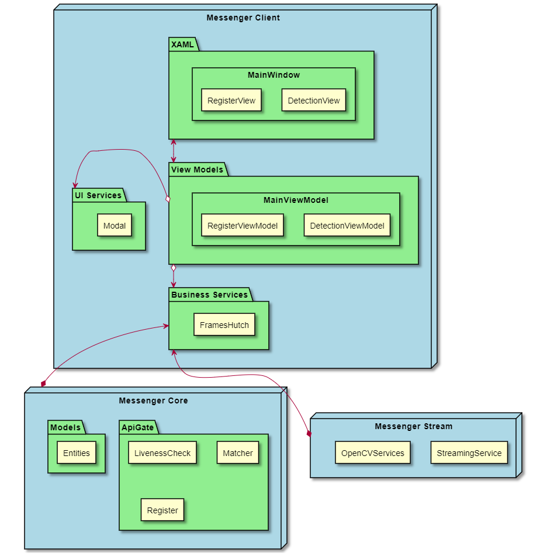
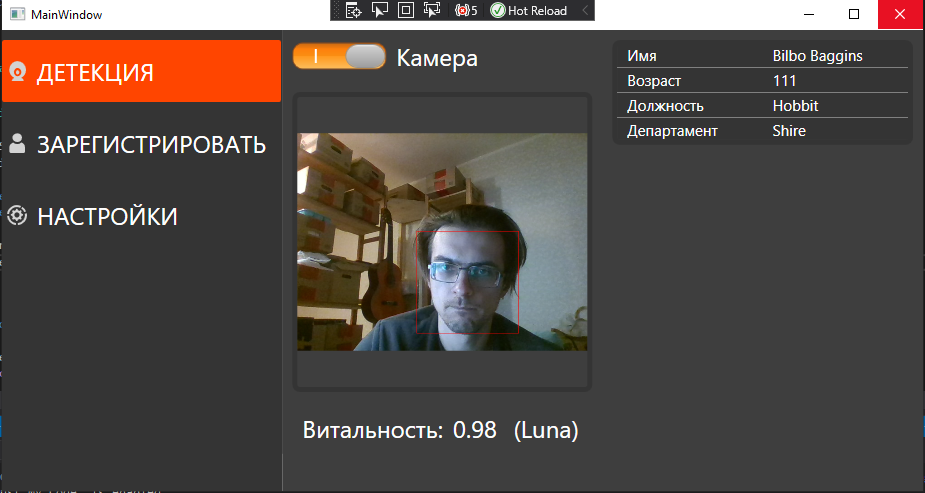
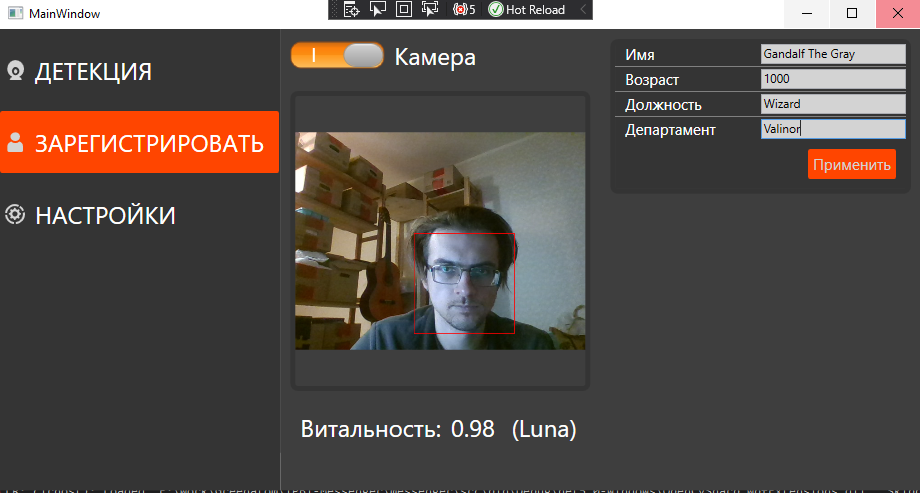
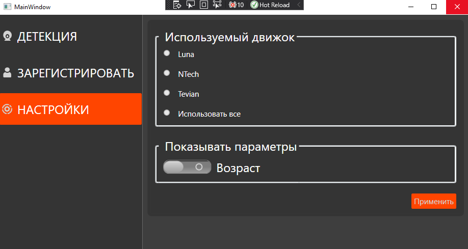

# IBTP Messenger Client

## 1. Введение
WPF приложение, представляющее из себя фронтэнд, тонкий клиент к бэкенду с сервисами IBPT, релизующий первичную детекцию c помощью библиотеки OpenCV

## 2. Структура программного обеспечения
Ниже представлена диаграмма проектов,  представлений, моделей представлений и служебных сервисов в солюшене:

## 3. Используемые технологии
В проекте использована технология WPF, платформа .Net 5 и язык программирования C# 9 версии. Для первичной детекции и всей работы с камерой используется OpenCV. Данное ПО содержит библиотеку OpenCvSharp, которая представляет из себя биндинги к оригинальной C++ библиотеке OpenCV  для платформы .Net.
Ввиду особенностей технологии, данный проект предназначен для сборки и запуска только на ОС Windows. Но зависимость от Windows сохраняется исключительно в проекте Messenger Client, в модуле XAML. Все остальные части написаны кросплатформенно, без исопльзования windows-only библиотек, что позволит в дальнейшем без усилий "отбросить" платформозависимую часть представления, и подключить данное решение к веб/десктоп UI для Linux или Mac, например, используя фреймворк Avalonia или Blazor.
OpenCvSharp тоже является кросплатформенным решением.

## 4. UI
Для MVP на данный момент используются три страницы - ДЕТЕКЦИЯ, РЕГИСТРАЦИЯ и НАСТРОЙКИ.
Для ДЕТЕКЦИИ, при включеннной камере программа ищет лица в видеопотоке, и если лицо определено и данный дескриптор существует в БД - выводится информация о пользователе.
Для РЕГИСТРАЦИИ,  при включеннной камере программа ищет лица в видеопотоке, и если лицо определено - появляется возможность снять дескриптор и занести информацию о пользователе в БД.
В НАСТРОЙКАХ возможно выбрать движок для детекции/регистрации и выбрать параметры, которые будут отображаться при детекции.




## 5. Описание API Gate

## 6. Сборка в КСПД
Восстановить nuget пакеты утилитой nuget.exe (C:\Dev\nuget.exe):
Для восстановления пкетов из nexus репозитория в папке src находится nuget.config, нацеленный на nexus.rosatom.local.
```
nuget.exe restore
```

Собрать проект утилитой dotnet:

```
dotnet publish '.src\Messenger.Client\Messenger.Client.csproj' -o \Messenger_publish --runtime win-x64 -p:PublishSingleFile=true 
```
